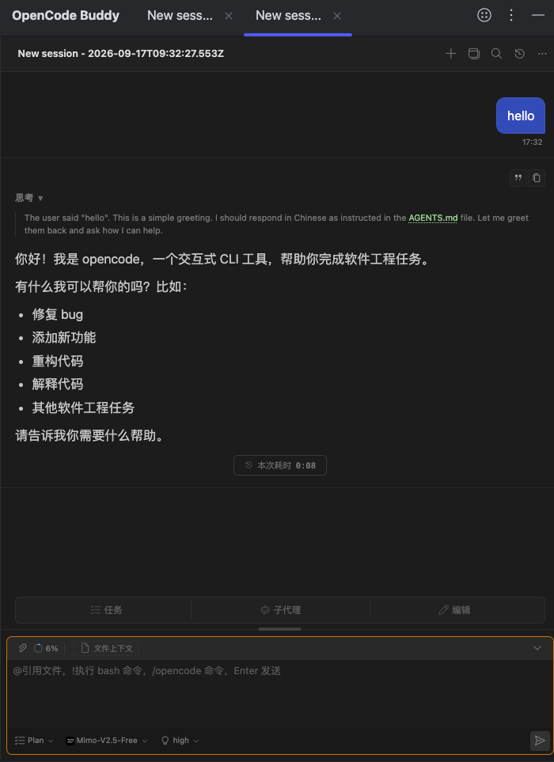
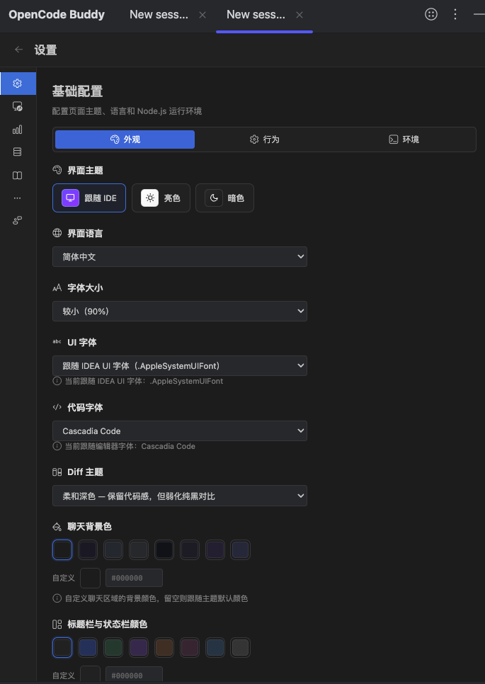

<div align="center">

# OpenCode Buddy (JetBrains)

> opencode-native GUI for IntelliJ IDEA · opencode 的 JetBrains IDE 可视化插件

**English** · [简体中文](./README.zh-CN.md)

</div>

A JetBrains IDE plugin that brings the **opencode** agent into a full chat GUI.

The plugin keeps a **persistent `opencode serve` daemon** (via `@opencode-ai/sdk` v2) alive across all tabs
and conversations, managed by the `ai-bridge` daemon with prewarm, heartbeat, crash-restart and session reuse.

## Philosophy

[`jetbrains-cc-gui`](https://github.com/zhukunpenglinyutong/jetbrains-cc-gui) aims to provide a unified
experience across different AI providers. This project takes a different approach — it **reuses opencode's
capabilities without secondary development**, focusing on providing a native GUI experience for opencode.

## Development Tools

This project is primarily developed with AI assistance:

- **AI Tools**: AntiGravity (primary), Claude Code
- **AI Models**: Gemini 3.7 (primary), Deepseek-v4-flash

A Gemini Pro subscription was purchased and DeepSeek cost about ¥82.15. If you find this plugin useful,
donations are welcome — they help cover those costs.

## Features

- **Multi-Tab & Multi-Session Management** — Open multiple independent conversation tabs inside the IDE tool window. Supports tab renaming, one-click creation, closing, detaching into floating windows, and live "answering / completed" status indicators.
- **Persistent opencode Daemon** — No per-message process spawning. `opencode serve` (default port 4096, overridable with `OPENCODE_PORT`) runs as a persistent background daemon via `@opencode-ai/sdk` v2 with prewarm, heartbeat, and crash recovery.
- **Rich Chat Surface** — SSE streamed responses, collapsible thinking deltas, tool-call cards with inline code diffs, generation interruption, and turn-by-turn edit / rewind.
- **Native Input & Rich Context** — `@filename` fuzzy file search and insertion, image and attachment drag-and-drop / clipboard pasting, opencode slash commands (`/init`, `/review`, …), and `!shell` / `$` command execution.
- **Agent, Models & Reasoning Effort** — One-click `Build` / `Plan` mode switching, full sync with all Provider + Model options in your local opencode configuration, custom model settings, reasoning-effort (variant) selection, and Always Thinking toggle.
- **Interactive Approvals & Question Flows** — Native inline dialogs for tool execution / file modification permissions (Once / Always / Reject), Ask User Question interactive forms, and Plan Approval review.
- **Session History, Search & Markdown Export** — Local session index with search (`Ctrl+F` / `⌘F`), session revert, conversation branching (Fork), context compaction, one-click export to Markdown (`.md`), and OpenCode Web share link generation.
- **Token Usage & TokenTracker Dashboard** — Real-time token consumption indicator and context window percentage, expandable context usage breakdown, and built-in multi-dimensional TokenTracker dashboard (request count, consumption charts, cost estimation).
- **MCP Marketplace & Skills** — MCP server status monitoring, tools overview, one-click install/uninstall/configure via the built-in MCP Marketplace, and workspace/managed Skills scanning.
- **Deep IDE Integration & Customization** — Auto light/dark theme adaptation with the IDE, IDE editor & UI font synchronization (with custom font & size support), status-bar widget for agent status, terminal/console output awareness, and bilingual UI (English / 简体中文).

## Usage

### 1. Open the chat window

Install the plugin, then open **View → Tool Windows → OpenCode** (docked in the right sidebar stripe). The plugin reuses an `opencode serve` instance when one is already running and otherwise starts its own daemon automatically.



*The screenshot shows the UI in Simplified Chinese.*

The chat window contains:

- **Top Tab Bar** — Multi-tab concurrent conversations; tabs maintain independent state and can be renamed, closed, detached into floating windows, or saved as templates.
- **Top Action Bar** — Back navigation, new conversation, new tab (`+`), in-conversation search, session share link, fork conversation, export Markdown, session history, and settings.
- **Message Area** — Streamed responses, collapsible thinking blocks, tool calls with interactive diffs.
- **Input Box** — `@filename` attaches files, `/command` runs opencode slash commands, `!command` runs shell commands, image attachments via drag & drop or paste. `Enter` sends, `Shift+Enter` inserts a newline (customizable in settings).
- **Bottom Toolbar** — `Build` / `Plan` mode switch, Provider & model selector, reasoning effort, Token usage indicator (click to view context breakdown), and settings gear icon.

### 2. Common Operations & Interaction Guide

| Action / Feature | Description |
|---|---|
| **Multi-Tab Sessions** | Click `+` in the header or toolbar to add new tabs; each tab runs an isolated session. Detach tabs into floating windows via the tab controls |
| **File Mentions & Completion** | Type `@` in the input box to trigger fuzzy file search in the project, navigate with arrow keys, and press Enter to insert |
| **Slash Command Completion** | Type `/` to open the command palette (e.g., `/init`, `/review`, `/compact`, …) |
| **Quick Shell Execution** | Prefix input with `!` or `$` to execute shell commands directly |
| **Images & Attachments** | Drag and drop image files directly into the input box or paste from clipboard (`Ctrl+V` / `⌘V`) |
| **In-Conversation Search** | Click the search icon in the header or press `Ctrl+F` / `⌘F` inside the chat window |
| **Export Markdown** | Click the document export icon in the header to save the conversation (dialogue, thinking, tool calls, and diffs) as a `.md` file |
| **Share Session** | Click the share icon in the header to generate an OpenCode Web share link and copy it to clipboard |
| **Revert & Fork** | Rollback to any previous step (Revert) or branch off into a new session from that point (Fork) |
| **Approvals & Questions** | Responsive inline cards for permission approvals (once / always / reject) and interactive questionnaire forms |
| **Token Usage Breakdown** | Click the token percentage pill in the toolbar to inspect model context window usage and prompt/completion breakdowns |

### 3. Settings

Click the **gear icon** in the top-right of the chat window to open Settings. Persistent configuration is stored under `~/.opencodebuddy`:

- **Basic Configuration**:
  - **Appearance**: Theme selection (Follow IDE / Light / Dark), font sync (sync with IDE font / custom font file & size), chat background color, user message color, and diff highlighting theme.
  - **Behavior**: Send shortcut (`Enter` vs `⌘+Enter`), auto open file, diff expanded by default, confirm dialogs (new session / compaction), task completion balloon notifications, question prompts, approval timeouts, and sound notifications.
  - **Environment**: Node.js path auto-detection & custom path, `opencode` CLI path configuration & validation, custom working directory.
- **Provider Management**: View and configure opencode providers and models, with support for custom model parameters.
- **Usage Statistics**: Integrated TokenTracker dashboard with token trends, request frequencies, and cost estimations.
- **MCP Servers**: Server status monitoring, tool catalog, and the **MCP Marketplace** for installing, configuring, and updating MCP servers.
- **Skills**: Scan and manage project workspace and global skills.
- **Other Settings**: History retention limit, prompt cache, and maintenance.
- **Community & Sponsor**: Version changelog, feedback channels, and sponsor links.



*Settings → Basic Configuration → Appearance; UI labels are in Simplified Chinese.*

## Requirements

- A JetBrains IDE **2023.3+** with JCEF support (IntelliJ IDEA, PyCharm, Rider …).
- **Node.js 18+** — the `ai-bridge` daemon runs on the Node runtime detected on your machine.
- The **opencode CLI** installed and configured (`opencode auth login`). Credentials and model configuration stay
  in the opencode CLI — the plugin never proxies them to a cloud service of its own.

## Development

The repository has three parts, each with its own dependencies:

| Part | Role | Install | Build |
|---|---|---|---|
| `src/main/java/` | JetBrains plugin host (JCEF bridge, handlers, actions, tool window) | — | `./gradlew compileJava` |
| `webview/` | React 19 + Vite + Tailwind + antd chat UI (ported from cc-gui) | `cd webview && npm ci` | `cd webview && npm run build` |
| `ai-bridge/` | Persistent daemon: `opencode serve` + `@opencode-ai/sdk` | `cd ai-bridge && npm ci` | ESM, run directly — no bundle step |

Both npm installs run automatically as part of the Gradle build when `node_modules` is missing, so
`./gradlew buildPlugin` works from a fresh checkout on its own.

### Commands (Gradle)

| Task | Command |
|---|---|
| Run a sandbox IDE with the plugin | `./gradlew runIde` |
| Build the distributable zip | `./gradlew buildPlugin` (→ `build/distributions/`) |
| Java unit tests | `./gradlew test` |
| Verify against a real IDE build | `./gradlew verifyPlugin` |
| Regenerate `plugin.xml` (compat range + change notes) | `./gradlew patchPluginXml` |
| Skip the webview build | add `-PskipWebview=true` |
| Build for another IDE (PyCharm / Rider) | add `-PtargetIde=PC`, `-PtargetIde=PY` or `-PtargetIde=RD` |

### Commands (webview)

| Task | Command |
|---|---|
| Build | `cd webview && npm run build` (tsc → vite build, single-file bundle) |
| Unit tests | `cd webview && npm test` (vitest) |
| E2E tests | `cd webview && npm run test:e2e` (Playwright) |
| Type-check only | `cd webview && npx tsc --noEmit` |

## Architecture

```
webview/ (React SPA, JCEF)  ⇄  Java plugin host (JBCefJSQuery + MessageDispatcher)
                            ⇄  ai-bridge/daemon.js (NDJSON over stdio, persistent Node process)
                            ⇄  opencode serve --port 4096 (@opencode-ai/sdk v2) + event.subscribe SSE
```

- The webview talks to the host with `sendToJava("type:content")`; the host replies by calling
  `window[fn](...args)` inside JCEF. All chat panels share one message dispatch path.
- `ai-bridge/daemon.js` speaks NDJSON over stdio: `{id, method, params}` requests, `{id, line}` streaming
  output, `{type:'daemon', event}` lifecycle events. Requests are non-blocking and concurrent requests are
  isolated with `AsyncLocalStorage`.
- Sessions, message history and the settings cache live under `~/.opencodebuddy`; the plugin keeps a local
  session index because `opencode serve` is the source of truth for messages.

Java module layout (`src/main/java/com/opencodebuddy/`):

```
action/        editor, project view, console, VCS (commit message) and chat actions
bridge/        Node/opencode detection, ai-bridge daemon lifecycle, NDJSON client
handler/       one handler per webview message type (settings, provider, permissions, …)
permission/    permission / question approval services and tool interception
session/       session + message conversion, revert / fork / compaction
provider/      opencode provider wiring and model catalogue
mcp/ skill/    MCP servers, skills
ui/            tool window, tabs, detached window, JCEF initialisation
notifications/ status-bar widget and balloon notifications
settings/      persisted plugin settings (~/.opencodebuddy)
util/ utils/   fonts, i18n, token usage, platform helpers
```

## Documentation

Design notes live in [`docs/`](./docs) (Simplified Chinese):

| Document | Covers |
|---|---|
| [input-commands-and-mentions.md](./docs/input-commands-and-mentions.md) | `@file` mentions, `!shell`, `/opencode` commands |
| [file-attachment-and-message-flow.md](./docs/file-attachment-and-message-flow.md) | Attachments and the message pipeline |
| [permission-and-question-flow.md](./docs/permission-and-question-flow.md) | Permission / question approval flows |
| [session-compaction.md](./docs/session-compaction.md) · [undo-redo-and-fork-flow.md](./docs/undo-redo-and-fork-flow.md) | Compact, revert, fork |
| [version-and-changelog-strategy.md](./docs/version-and-changelog-strategy.md) | Changelog fetching, cache and fallback |
| [token-consumption-indicator.md](./docs/token-consumption-indicator.md) · [font-system-and-ui-alignment.md](./docs/font-system-and-ui-alignment.md) | Usage indicator, fonts and theme sync |

## Support

If you find this useful, consider supporting:

| WeChat | Alipay | PayPal |
|:---:|:---:|:---:|
|  |  |  |

## Acknowledgements

Thanks to the original project [`jetbrains-cc-gui`](https://github.com/zhukunpenglinyutong/jetbrains-cc-gui) —
please give it a star and consider supporting the original author — and to the sibling VS Code port
[`opencode-vscode-plugin`](https://github.com/SenjuObito/opencode-vscode-plugin).

## Sponsor

If this project helps you, consider sponsoring to support ongoing maintenance~

[View sponsors list →](SPONSORS.md)

## License

[MIT](./LICENSE)
