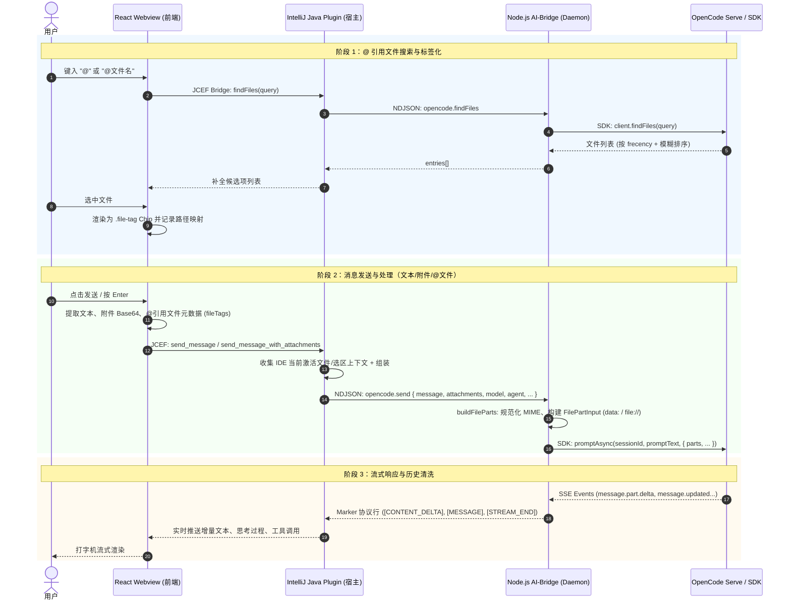

# OpenCode IDEA GUI：文件识别、文件发送、@引用与文本交互完整流程

本文档系统阐述了在 **OpenCode IDEA GUI** 插件中，**识别文件（补全与提取）**、**发送文件（附件/图片/代码）**、**@ 引用文件（标签化与上下文注入）** 以及 **发送普通文本** 的端到端完整链路实现，涵盖前端 WebView、IntelliJ 平台 Java 宿主层、Node.js AI-Bridge Daemon 层以及 OpenCode Server / SDK 层的协同机制。

---

## 1. 架构总览

整个交互链路采用 **分层解耦、事件流式驱动** 的架构设计：



---

## 2. 核心交互流程详解

### 2.1 识别文件与 @ 引用文件流程

#### (1) 触发与搜索
- **输入捕获**：在 `ChatInputBox` 中，用户输入 `@` 触发 `useCompletionTriggerDetection`，检测光标所在位置的查询词。
- **文件检索**：通过 JCEF 桥向 Java 端发送 `findFiles` 请求。
  - Java 端 `OpenCodeSDKBridge.findFiles` -> 转发给 Daemon `opencode.findFiles`。
  - Daemon 调用 `@opencode-ai/sdk` 的 `findFiles`，OpenCode 服务端基于项目文件系统的使用频率（frecency）与模糊匹配返回候选文件列表。

#### (2) 标签化渲染（File Tag Chip）
- **选择插入**：用户从下拉列表中选中目标文件后，`useFileTags` 将选中的 `@path` 转换为内联标签元素：
  ```html
  <span class="file-tag has-tooltip" contenteditable="false" data-file-path="src/main.ts" data-tooltip="/Users/.../src/main.ts">
    <span class="file-tag-icon"><svg>...</svg></span>
    <span class="file-tag-text">main.ts</span>
    <span class="file-tag-close">&times;</span>
  </span>
  ```
- **映射管理**：前端通过 `pathMappingRef` 维护展示名/相对路径到绝对路径的映射，支持包含行号标记（如 `#L10-20`）以及特殊终端/服务协议（如 `terminal://`、`service://`）。
- **光标保全**：替换 innerHTML 时通过 `virtualCursorUtils` 精确计算并恢复虚拟光标位置，防止输入跳动。

#### (3) 发送时元数据提取与后端注入
- **前端提取**：发送前调用 `extractFileTags()` 提取所有包含的 `{ displayPath, absolutePath }`，作为 `fileTags` 数组随 payload 发送。
- **Java 宿主注入**：
  - `SessionContextService.buildCodexContextAppend` 将 `fileTags` 转换为提示词末尾的参考文件说明：
    ```markdown
    ## Referenced Files
    The following files were referenced by the user:
    - `/Users/.../src/main.ts`

    Read them with your file tools as needed; the user expects answers based on their content.
    ```
  - **重要设计决策**：**不直接内联大段文件内容**。因为 OpenCode 具备智能体（Agentic）工具调用能力，传递文件绝对路径让模型按需使用 `Read` 工具读取，既避免溢出 Windows 命令行/提示词长度限制，又确保读取到最新的磁盘内容。

---

### 2.2 发送文件（附件 / 图片 / 代码 / 文本文件）流程

#### (1) 前端添加附件
- **多途径输入**：支持点击回形针按钮选取文件、从系统拖拽文件至输入框、或直接在输入框粘贴（Paste）截图/文件。
- **文件转换**：`useAttachmentHandlers` 通过 `FileReader.readAsDataURL` 将文件转换为 Base64 编码，并封装为 `Attachment` 对象：
  ```ts
  interface Attachment {
    id: string;
    fileName: string;
    mediaType: string;
    data: string; // Base64 数据（无 data URL 前缀）
  }
  ```
- **MIME 优化**：针对浏览器无法识别的无扩展名脚本或默认标记为 `application/octet-stream` 的文件进行脱敏，留给后端/Daemon 做二次 MIME 嗅探。

#### (2) 通信与 payload 传递
- 前端通过 JCEF 事件 `send_message_with_attachments` 将文本、附件数组、`fileTags` 等序列化后发送到 Java 端。
- Java 端 `SessionHandler` 解析附件列表，并通过 `OpenCodeSDKBridge.sendMessage` 将参数通过 stdin 传递给 AI-Bridge Daemon。

#### (3) AI-Bridge 层的 FilePart 规范化 (`buildFileParts`)
在 `ai-bridge/utils/cli-image-input.js` 中，Daemon 将附件构建为符合 OpenCode Server 标准的 `FilePartInput`：

1. **多模态类型（Native Multimodal）**：
   - 图片格式（`image/png`, `image/jpeg`, `image/webp`, `image/gif` 等）和 `application/pdf`：保留原生 MIME，生成 `data:<mime>;base64,<payload>`。
2. **代码与纯文本类型（Code / Plaintext）**：
   - JSON、YAML、TS、Java、Python、SQL、Markdown 等代码及文本文件：**统一强制规范化为 `text/plain`**。
   - **设计原因**：OpenCode Server 会将 `data:` + `text/plain` 的 FilePart 内联解析为可读文本内容；若直接传递 `application/json` 或其他非标准多模态 MIME，下游 LLM Provider 会报错“functionality not supported”。
3. **大小限制与安全过滤**：
   - 检查 Base64 解码后大小（单附件软上限为 4MB）。
   - 过滤不可读的二进制文件（如 `.zip`, `.exe`, `.class`, `.so` 等或前 1KB 包含 NUL 字符的 Buffer）。
4. **空文本兜底（Fallback Text）**：
   - 当用户仅发送附件而未输入任何文字时，自动补充安全提示词：
     - 仅包含图片：`Please analyze the attached image(s).`
     - 包含其他文件：`Please review the attached file(s).`
     - 避免 OpenCode 服务端因 Prompt 为空而拒绝请求。

#### (4) OpenCode SDK 提交
```js
await sdk.promptAsync(sessionId, promptText, {
  model: model || undefined,
  agent: agent || undefined,
  variant: variant || undefined,
  directory: directory || undefined,
  parts: fileParts, // 包含所有规范化后的 FilePartInput
});
```

---

### 2.3 发送普通文本流程

#### (1) 前端输入校验与清理
- **清理与防抖**：过滤零宽字符（`\u200B-\u200D\uFEFF`），展开引用块 Token（`expandQuoteTokens`）。
- **历史记录**：将本次输入存入 `useInputHistory` 本地缓存（支持上下键回溯历史）。
- **状态联动**：清空输入框并取消挂起的防抖回调，防止重复填充。

#### (2) Java 宿主层增强
- **斜杠命令解析**：检测是否为 `/compact`, `/fork`, `/share` 等本地内置命令或 `/custom_command`，若是斜杠命令则通过 `opencode.sendCommand`（`/session/{id}/command`）路由。
- **IDE 上下文自动收集**（`SessionContextService`）：
  - **活动编辑器与选区**：若用户在编辑器中选中了代码片段，自动生成带有行号范围的上下文标记（`## IDE Context`，如 `Active file: src/App.tsx#L20-L45`）。
  - **工作区多模块信息**：若处于 Multi-Module / Workspace 项目，注入子工程结构。
  - **Agent 角色指令**：若当前 Tab 启用了特定的 Agent 预设，追加 `## Agent Role and Instructions`。

#### (3) 调度与会话维护
- `OpenCodeSDKBridge` 将最终处理后的提示词发送至 Daemon。
- Daemon 自动管理 `sessionID`（复用现有或通过 `sdk.createSession` 创建新会话），并绑定项目工作目录（`directory`）。

---

## 3. 流式响应与历史回放清洗机制

### 3.1 运行时流式输出（Streaming）
OpenCode Server 通过 SSE（Server-Sent Events）推送事件，Daemon 将其映射为 stdout Marker 协议输出：

| Marker 协议行 | 含义 |
| :--- | :--- |
| `[MESSAGE_START] <sessionId>` | 会话/消息轮次开始 |
| `[CONTENT_DELTA] "<text>"` | 文本增量输出（打字机流式推送） |
| `[THINKING_DELTA] "<text>"` | 深度思考/推理过程增量 |
| `[MESSAGE] { tool_use / tool_result }` | 工具调用状态及返回结果 |
| `[PERMISSION_REQUEST] {...}` | 权限审批弹窗请求（Read/Write/Bash） |
| `[USAGE] {...}` | Token 消耗与成本统计 |
| `[STREAM_END] <sessionId>` | 当前轮次流式结束 |

Java 层的 `OpenCodeMessageHandler` 监听 Marker 并驱动 JCEF 将增量推入 Webview，实现流畅的打字机交互体验。

### 3.2 历史记录回放与清洗（Sanitizing）
当切换或重新打开历史会话时，`listMessages` 会从服务端拉取完整的消息部件（parts）。为了保证 UI 展现整洁，系统进行了两级清洗：

1. **服务端合成部件过滤（`OpenCodeMessageConverter`）**：
   - 过滤带有 `synthetic: true` 标记的部件（如服务端自动生成的 `Called the Read tool...` 以及展开的文件内容）。
   - 将 `type: "file"` 部件还原为前端的 Attachment Chip 或图片预览卡片。
2. **宿主注入上下文剥离（`UserTextSanitizer`）**：
   - 剥离发送时由 Java 插件附加的 `## IDE Context`、`## Referenced Files`、`## Agent Role and Instructions` 等模型专用上下文，仅将用户原始输入的文本呈现在聊天气泡中。

---

## 4. 关键代码模块索引

| 模块 / 文件 | 主要职责 |
| :--- | :--- |
| [`useFileTags.ts`](file:///Users/obito/source/repos/opencode-idea-gui/webview/src/components/ChatInputBox/hooks/useFileTags.ts) | 前端 `@` 文件引用匹配、`.file-tag` Chip 标签渲染与光标保全 |
| [`useAttachmentHandlers.ts`](file:///Users/obito/source/repos/opencode-idea-gui/webview/src/components/ChatInputBox/hooks/useAttachmentHandlers.ts) | 前端文件选取、拖拽、粘贴与 Base64 转换 |
| [`useSubmitHandler.ts`](file:///Users/obito/source/repos/opencode-idea-gui/webview/src/components/ChatInputBox/hooks/useSubmitHandler.ts) | 前端输入提交、历史记录、上下文提取与状态重置 |
| [`SessionHandler.java`](file:///Users/obito/source/repos/opencode-idea-gui/src/main/java/com/opencodebuddy/handler/SessionHandler.java) | JCEF Bridge 消息入口，解析 payload 并调度发送 |
| [`SessionContextService.java`](file:///Users/obito/source/repos/opencode-idea-gui/src/main/java/com/opencodebuddy/session/SessionContextService.java) | 注入 IDE 上下文、活动文件选区与 `## Referenced Files` |
| [`OpenCodeSDKBridge.java`](file:///Users/obito/source/repos/opencode-idea-gui/src/main/java/com/opencodebuddy/provider/opencode/OpenCodeSDKBridge.java) | Java 与 Node.js AI-Bridge Daemon 的双向通信门面 |
| [`opencode-daemon-service.js`](file:///Users/obito/source/repos/opencode-idea-gui/ai-bridge/services/opencode/opencode-daemon-service.js) | 常驻 `opencode serve` 守护进程管理、会话维护与 SSE 监听 |
| [`cli-image-input.js`](file:///Users/obito/source/repos/opencode-idea-gui/ai-bridge/utils/cli-image-input.js) | 附件解析、MIME 智能规范化、`FilePartInput` 构建与体积校验 |
| [`OpenCodeMessageConverter.java`](file:///Users/obito/source/repos/opencode-idea-gui/src/main/java/com/opencodebuddy/session/OpenCodeMessageConverter.java) | 历史消息转换，过滤合成内容并还原附件 Chip |
| [`UserTextSanitizer.java`](file:///Users/obito/source/repos/opencode-idea-gui/src/main/java/com/opencodebuddy/session/UserTextSanitizer.java) | 剥离注入上下文，还原纯净用户文本 |
