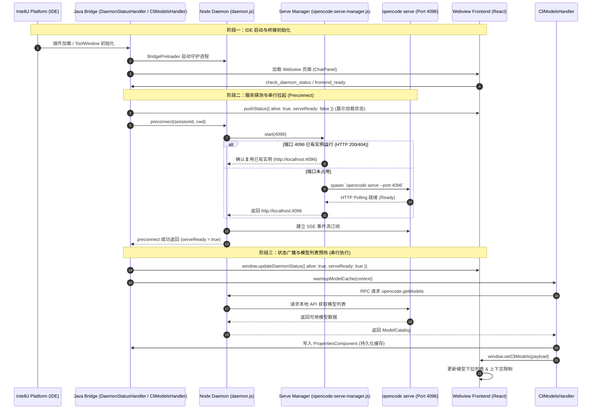

# OpenCode IDEA GUI 插件启动生命周期与服务管理机制

## 1. 概述与核心设计目标

OpenCode IDEA 插件通过 Node.js 守护进程（Daemon Bridge）与本地 `opencode serve` 服务协同工作，为开发者提供智能补全、对话、模型切换与上下文感知能力。

在旧版本启动过程中，由于前端组件加载与后端守护进程探测并发执行，且模型列表获取存在降级为独立子进程（`channel-manager.js listModels`）并强杀运行中实例的逻辑，容易造成多实例竞争、端口抢占与反复重启。

**重构后的核心设计原则**：
1. **单实例生命周期保障**：`opencode serve` 进程全生命周期由 `opencode-serve-manager.js` 统一管理，支持端口探测、安全复用与幂等拉起。
2. **启动与模型获取严格串行化**：先拉起并确认 `opencode serve` 就绪（`serveReady: true`），再由守护进程串行化获取可用模型列表并异步预热。
3. **消除冗余子进程与误杀**：彻底移除 `listModelsViaChannelManager` 独立子进程逻辑，模型获取走 Daemon RPC，失败时回退到持久化缓存，绝不执行外部进程强杀。
4. **健全的运行状态判定（`isRunning`）**：无论进程是插件自身拉起还是复用系统既有端口，均能准确判定运行状态，防止重复拉起。

---

## 2. 插件启动生命周期流程图



---

## 3. 关键模块与状态机制说明

### 3.1 `opencode-serve-manager.js` 状态判定与复用

- **`isRunning()` 状态判定**：
  ```javascript
  export function isRunning() {
    if (_process !== null && !_process.killed) {
      return true;
    }
    return _started && _serverUrl !== null;
  }
  ```
  - 支持 **自拉起子进程** 与 **复用外部既有端口** 两种运行模式的准确判定。
- **`start(port)` 幂等性**：
  - 若已处于运行/复用状态直接返回 `_serverUrl`。
  - 使用单例 Promise `_startPromise` 合并并发请求，避免重入。
- **`stop()` 安全退出**：
  - 仅杀死自身 spawn 的子进程；若为外部复用服务，仅清理内部状态，绝不越权强杀外部进程。

### 3.2 `DaemonStatusHandler` 串行化与去重

- **`preconnectInFlight` 保证单飞**：使用 `AtomicBoolean` 避免启动阶段前端多次触发 `check_daemon_status` 产生并发 preconnect。
- **状态不回退**：若此前已就绪（`alive && lastServeReady`），直接响应已就绪，避免 UI 闪烁回退到 Loading 状态。
- **就绪后串行触发模型预热**：在确认 `serveReady: true` 的回调中触发 `CliModelsHandler.warmupModelCache()`。

### 3.3 `CliModelsHandler` 缓存优先与 RPC 通信

- **移除 Channel-Manager 独立进程**：不再通过 `node channel-manager.js ... listModels` 拉起临时实例，杜绝因临时进程生命周期结束导致全局服务被误杀。
- **两级获取策略**：
  1. **本地持久化缓存（Cache-First）**：立即向前端推流已缓存模型列表，保障界面秒开。
  2. **守护进程 RPC（Daemon Path）**：在服务就绪后通过 `opencode.getModels` 获取最新模型列表，更新缓存并推送给前端。

---

## 4. 异常处理与自愈机制

1. **服务意外退出（Crash Recovery）**：
   - 进程非预期退出时触发 `scheduleAutoRestart()`。
   - 采用指数退避算法（`BACKOFF_BASE_MS * 2^attempts`，上限 10 秒，最多重试 5 次）。
2. **守护进程心跳丢失**：
   - `onDaemonDied()` 回调触发，通知前端 `pushStatus(false, false)`，界面显示重试按钮。
3. **超时保护**：
   - `opencode serve` 启动超时设为 15 秒；`preconnect` 守护超时设为 60 秒；`getModels` RPC 超时设为 90 秒。
