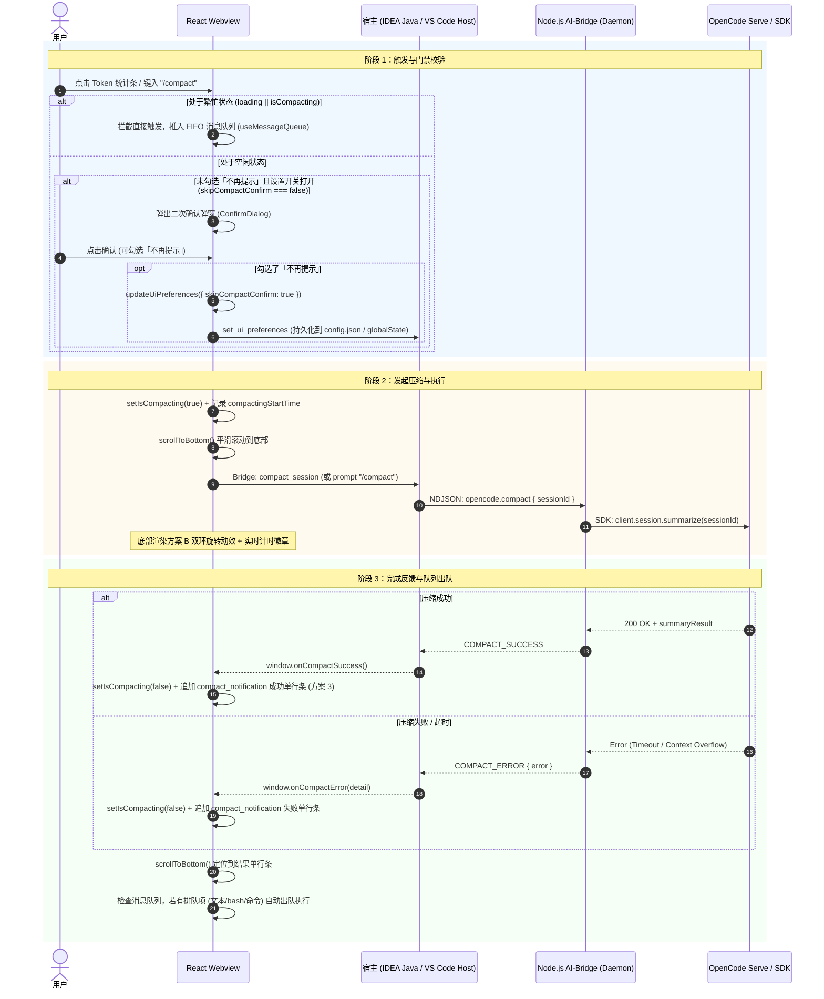

# OpenCode 会话压缩（/compact）功能与架构设计文档

本文档系统阐述了在 **OpenCode IDEA GUI** 与 **OpenCode VS Code Plugin** 双端插件中，**会话上下文压缩（Session Compaction / `/compact`）** 的完整技术方案与架构逻辑，涵盖前端 React Webview、IntelliJ IDEA Java 宿主层、VS Code 扩展层、Node.js AI-Bridge Daemon 层以及 OpenCode Server / SDK 层的协同交互机制。

---

## 1. 架构总览与交互流

整个会话压缩流程遵循 **单向数据流、状态互斥防护、全输入 FIFO 排队、单数据源持久化** 的设计原则：



---

## 2. 核心功能与模块设计

### 2.1 触发入口与门禁校验

用户可以通过以下 3 种方式触发压缩会话：
1. **Token 统计指示器**（[`ContextBar.tsx`](../webview/src/components/ChatInputBox/ContextBar.tsx)）：输入框顶部的上下文 Token 用量胶囊，点击即可触发；
2. **斜杠命令**：在输入框键入 `/compact`；
3. **快捷操作与菜单**：通过输入框 Slash 自动补全菜单选中 `/compact`。

#### 互斥与禁用防护
- 当处于 **AI 响应中 (`loading === true`)** 或 **正在压缩中 (`isCompacting === true`)** 时：
  - `ContextBar` 中的 Token 统计条设为 `disabled`，光标设为 `not-allowed`，并显示禁用 Tooltip（`chat.compactDisabledTooltip`）；
  - `ChatScreen.tsx` 的 `handleCompact` 增加 `if (loading || isCompacting) return;` 阻断；
  - `useCompactConfirm.ts` 的 `requestCompact` 增加 `isBusy` 参数拦截，防止任何非预期入口重复调用。

---

### 2.2 全命令与消息统一 FIFO 队列

为了与 `opencode serve` / TUI 的队列规范保持完全一致，当会话处于繁忙状态（生成中或压缩中）时，输入框支持全量命令排队：

| 输入类型 | 示例 | 繁忙状态处理 (loading \|\| isCompacting) | 空闲状态处理 |
| :--- | :--- | :--- | :--- |
| **视图/重置命令** | `/new`, `/clear`, `/resume` | **绕过队列**，立即执行（重置或切换视图） | 立即执行 |
| **内置会话命令** | `/compact`, `/undo`, `/redo`, `/fork`, `/share` | **推入 FIFO 消息队列** | 立即弹出确认或本地执行 |
| **终端命令** | `$ls -la`, `!git status` | **推入 FIFO 消息队列** | 立即调用 `executeMessage` 发送 |
| **自定义命令** | `/doc`, `/test`, `/review` | **推入 FIFO 消息队列** | 立即调用 `executeMessage` 发送 |
| **普通文本/引用** | `请帮我审查代码`, `@file.ts` | **推入 FIFO 消息队列** | 立即调用 `executeMessage` 发送 |

#### 队列调度器机制（[`useMessageQueue.ts`](../webview/src/hooks/useMessageQueue.ts) & [`App.tsx`](../webview/src/App.tsx)）
- 队列采用严格的先进先出（FIFO）结构；
- 当 `isLoading` 或 `isCompacting` 状态从 `true -> false`（即上一轮生成或压缩完成）时，调度器自动触发下一个排队任务：
  ```tsx
  const executeFromQueue = useCallback((content: string, attachments?: Attachment[]) => {
    const text = content.replace(/[\u200B-\u200D\uFEFF]/g, '').trim();
    if (text.startsWith('/')) {
      const command = text.split(/\s+/)[0].toLowerCase();
      if (BUILTIN_SESSION_COMMANDS.has(command)) {
        handleBuiltinCommand(command);
        return;
      }
    }
    executeMessage(content, attachments);
  }, [handleBuiltinCommand, executeMessage]);
  ```

---

### 2.3 二次确认弹窗与偏好设置单源同步

压缩会话属于不可撤销操作（会由 OpenCode 服务端生成摘要并截断修剪历史消息），因此默认提供二次确认机制。

#### 单持久化源（Single Source of Truth）
为了杜绝「弹窗勾选了不再提示，但设置页开关仍开启」以及「页面刷新/IDE 重启后状态丢失」的问题，双端统一采用单一数据源持久化：

```
                    ┌───────────────────────────────┐
                    │     用户勾选「不再提示」       │
                    │   或 设置页切换「二次确认」   │
                    └───────────────┬───────────────┘
                                    │
                                    ▼
                    ┌───────────────────────────────┐
                    │   utils/skipCompactConfirm.ts │
                    │   utils/uiPreferences.ts      │
                    └───────┬───────────────┬───────┘
                            │               │
            ┌───────────────┘               └───────────────┐
            ▼                                               ▼
┌───────────────────────────────┐               ┌───────────────────────────────┐
│     本地内存与 localStorage    │               │  宿主持久化 (Bridge 通信)      │
│  - in-memory current state    │               │  - IDEA: ~/.opencodebuddy/config.json │
│  - localStorage['skipCompact']│               │    (uiPreferences 节点)       │
│  - CustomEvent 广播通知       │               │  - VS Code: globalState       │
└───────────────────────────────┘               └───────────────────────────────┘
```

1. **`skipCompactConfirm.ts`**：
   - `getSkipCompactConfirm()`：优先从 `getUiPreferences().skipCompactConfirm` 读取；
   - `setSkipCompactConfirm(value)`：通过 `updateUiPreferences({ skipCompactConfirm: value })` 同步写入内存、`localStorage`、向宿主发送 `set_ui_preferences`，并触发 `skipCompactConfirmChanged` 事件。
2. **Java 宿主层（[`OpenCodeBuddySettingsService.java`](../src/main/java/com/opencodebuddy/settings/OpenCodeBuddySettingsService.java) & [`SettingsHandler.java`](../src/main/java/com/opencodebuddy/handler/SettingsHandler.java)）**：
   - 在 `~/.opencodebuddy/config.json` 的 `uiPreferences` 节点下持久化保存；
   - 实现 `get_ui_preferences` 与 `set_ui_preferences` 处理分支，通过 `window.applyUiPreferences` 与 Webview 进行权威状态双向同步。

---

### 2.4 视觉规范与动效设计

#### 1. 压缩中状态（方案 B：同心双环 + 微拟物计时徽章）
- **组件**：[`CompactingIndicator.tsx`](../webview/src/components/CompactingIndicator.tsx)
- **样式**：[`loading.less`](../webview/src/styles/less/components/loading.less)
- **视觉特征**：
  - **外环**：顺时针 1.1s 旋转（主题色高亮）；
  - **内环**：逆时针 0.8s 旋转（次要描述色）；
  - **动态打点**：`正在压缩会话...`（CSS 文本打点动画）；
  - **幽灵计时徽章**：右侧展示 `00:06` 动态计时（等宽字体、微拟物半透明圆角底色）。

#### 2. 完成态通知（方案 3：极简紧凑单行条）
- **组件**：[`ContentBlockRenderer.tsx`](../webview/src/components/MessageItem/ContentBlockRenderer.tsx)
- **样式**：
  ```less
  .compact-card-wrapper {
      padding: 0;
      width: 100%;
      display: flex;
      box-sizing: border-box;
  }

  .compact-card--compact-pill {
      padding: 6px 12px;
      border-radius: 6px;
      font-size: 12px;
      margin: 8px 0;
      gap: 8px;
      line-height: 1.4;
      width: 100%;
      display: flex;
      align-items: center;
      box-sizing: border-box;
  }
  ```
- **视觉特征**：
  - **高度**：维持 28~30px 极简行高，不额外占据屏幕高度；
  - **宽度**：撑满消息列表容器宽度（100% width）；
  - **成功态**：翠绿色 `codicon-check` 前缀 + `会话已压缩` + `— 18 条消息已总结`；
  - **失败态**：珊瑚红 `codicon-warning` 前缀 + `压缩会话失败` + 错误信息摘要。

#### 3. 视口滚动控制（[`useScrollBehavior.ts`](../webview/src/hooks/useScrollBehavior.ts)）
- `useScrollBehavior` 监听 `isCompacting` 状态；
- 点击压缩触发时，强制重置 `userPausedRef.current = false; isUserAtBottomRef.current = true;`，并通过 `scrollToBottom()` 与 `requestAnimationFrame` 双重调度自动平滑滚动到底部；
- 压缩成功/失败回调到达后，同样执行触底调度，确保用户无需手动滚动即可查看最新结果。

---

## 3. 通信协议与接口定义

### 3.1 Webview 与 宿主 Bridge 通信

| 协议指令 / 事件 | 方向 | 载荷参数 | 说明 |
| :--- | :--- | :--- | :--- |
| `compact_session` | Webview → Host | 无 | 请求对当前会话发起压缩总结 |
| `get_ui_preferences` | Webview → Host | 无 | Webview 就绪或设置页打开时获取宿主持久化的 UI 偏好 |
| `set_ui_preferences` | Webview → Host | `JSON string` (Partial<UiPreferences>) | 偏好发生变动时增量推送至宿主持久化 |
| `window.applyUiPreferences` | Host → Webview | `JSON string` (UiPreferences) | 宿主向 Webview 推送权威偏好完整镜像 |
| `window.onCompactSuccess` | Host → Webview | 无 | 压缩成功通知，前端关闭 loading 并追加成功气泡 |
| `window.onCompactError` | Host → Webview | `detail?: string` | 压缩失败通知，前端关闭 loading 并追加失败气泡 |

---

## 4. 单元测试与质量保证

项目在前端（Vitest）和 Java 后端（JUnit）均建立了完善的自动化测试覆盖：

1. **`src/hooks/useMessageQueue.test.ts`**
   - 验证队列初始化为空；
   - 验证普通消息、`/compact` 命令、`$bash` 命令的正常入队与按 ID 出队；
   - 验证 `isLoading` 从 `true -> false` 时的 FIFO 自动出队与定时器调度；
   - 验证 `isCompacting` 从 `true -> false` 时的自动出队。
2. **`src/hooks/useCompactConfirm.test.ts`**
   - 验证弹窗初始状态、请求弹出、跳过直接执行；
   - 验证确认、取消、勾选「不再提示」的持久化行为；
   - 验证 `isBusy = true` 时的全局无操作阻断（no-op）。
3. **`src/utils/skipCompactConfirm.test.ts`**
   - 验证默认状态、localStorage 读写、正向语义转换及 CustomEvent 广播。
4. **`src/components/MessageItem/ContentBlockRenderer.test.tsx`**
   - 验证方案 3 紧凑单行条在成功态（翠绿 `codicon-check` + 统计）与失败态（珊瑚红 `codicon-warning` + 错误信息）下的正确渲染。
5. **`src/components/ChatInputBox/ContextBar.test.tsx`**
   - 验证空闲与加载中状态下 Token 指示器的禁用、样式与 Tooltip。
6. **`src/components/CompactingIndicator.test.tsx`**
   - 验证双环旋转动效容器、国际化文案、计时徽章递增（秒/分秒格式）与 `startTime` 初始计算。
7. **`src/components/settings/BasicConfigSection/BehaviorTab.test.tsx`**
   - 验证设置页面中「压缩会话时二次确认」开关的展示与事件联动。
8. **`OpenCodeBuddySettingsServiceUiPreferencesTest.java`**
   - 验证 Java 后端在 `~/.opencodebuddy/config.json` 中对 `uiPreferences` 节点的读写、默认回退与增量合并持久化。
