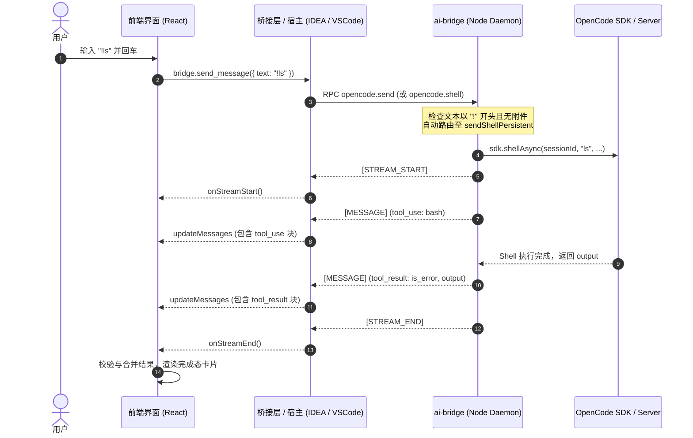

# Shell 命令 (`!`) 执行与状态流转机制

本文档详细说明在 OpenCode 插件（包括 IntelliJ IDEA 和 VSCode）中，通过输入框输入 `!<command>` 快捷执行本地 Shell 命令的完整架构流程、Marker 协议流转、前端卡片渲染与状态判定规则。

---

## 1. 功能概述

在聊天输入框中，用户以 `!` 为前缀输入命令（例如 `!ls -la`、`!git status`），系统会识别为本地终端命令执行意图，直接通过 OpenCode 的 Shell 执行接口调用本地终端执行命令，并将执行过程和输出以终端工具卡片（`BashToolBlock` / `BashToolGroupBlock`）的形式呈现在对话流中，而不会将命令作为普通自然语言 Prompt 发送给大模型进行多轮对话。

---

## 2. 架构与交互时序



---

## 3. 各层处理逻辑

### 3.1 `ai-bridge` 守护进程层 (`opencode-daemon-service.js`)

`sendMessagePersistent` 作为消息发送入口，对输入的文本进行命令拦截：
- **条件**：
  1. `!safeParams.command`（非显式斜杠命令）；
  2. `fileParts.length === 0` 且 `textAttachments.length === 0`（无附件）；
  3. `promptText.startsWith('!')` 且 `promptText.length > 1`。
- **处理**：提取 `promptText.slice(1).trim()`，若非空，直接转发调用 `sendShellPersistent`。
- `sendShellPersistent` 调用 `sdk.shellAsync(sessionId, rawCommand, ...)` 发起执行。

### 3.2 Marker 协议与事件广播

在 Shell 执行生命周期中，守护进程通过 stdout 输出 Marker 协议行：
1. `[STREAM_START]`：通知客户端开启流式状态，前端生成 Assistant 消息占位。
2. `[MESSAGE] {"type":"assistant","message":{"role":"assistant","content":[{"type":"tool_use","id":"<callID>","name":"bash","input":{"command":"..."}}]}}`：发送工具调用参数。
3. `[MESSAGE] {"type":"user","message":{"role":"user","content":[{"type":"tool_result","tool_use_id":"<callID>","is_error":<boolean>,"content":"<output>"}]}}`：发送工具执行输出与错误标识。
4. `[MESSAGE_END]` 与 `[STREAM_END]`：结束当前流，重置状态。

---

## 4. 前端渲染与状态判定规则

前端 Webview 在对话列表中展示命令卡片，其状态机与错误判定遵循以下规则：

### 4.1 快照提取与工具保留 (`streamingCallbacks.ts`)
在 `onStreamEnd` 触发时：
- 提取宿主最新推送的消息快照 `window.__pendingUpdateJson` 中的 `backendSnapshotRaw`。
- **关键**：即使 Assistant 消息文本 `content` 为空（纯工具回合），依然完整提取 `backendSnapshotRaw` 与 `tool_result`，防止工具调用卡片或执行结果丢失。

### 4.2 状态判定逻辑 (`BashToolBlock.tsx` / `GenericToolBlock.tsx`)
```typescript
const hasResult = result !== undefined && result !== null;
// 判定是否完成：已返回结果，或者由于用户拒绝/中断被置为已结束
const isCompleted = hasResult || isDenied;
// 判定是否错误：若已有实际执行结果，以 result.is_error 为最高优先级权威标准；
// 仅当没有结果且处于 isDenied 状态时，才展示为中断/拒绝错误
const isError = hasResult ? result.is_error === true : isDenied;
```

- **成功（绿色/完成态）**：`hasResult === true` 且 `result.is_error === false`（即使系统内部产生偶发 denied 标记，也不会覆盖真正的成功输出）。
- **执行失败（红色错误态）**：`hasResult === true` 且 `result.is_error === true`（如命令退出码非 0，命令不存在等）。
- **用户中断/拒绝（红色错误态）**：`hasResult === false` 且 `isDenied === true`。
- **执行中（转圈/Pending态）**：`hasResult === false` 且 `isDenied === false`。

---

## 5. 常见异常与防护措施

1. **多端统一路由**：VSCode 和 IDEA 统一经 `ai-bridge` 的 `sendMessagePersistent` 拦截 `!`，保证在任何接入端输入 `!cmd` 都能稳定触发 Shell 命令。
2. **避免误报中断**：在 `collectUnresolvedToolUseIds` 中，扫描未决工具时先在整条消息链中核对是否存在匹配的 `tool_result`，避免因为消息结构或事件时序导致已完成的工具被误加入 `__deniedToolIds`。
