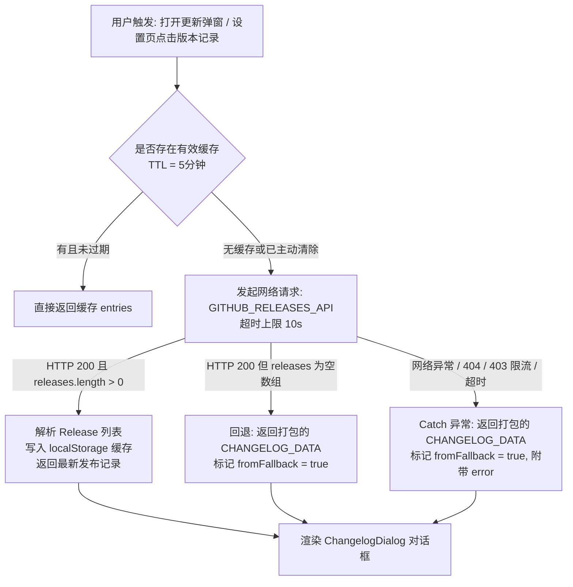

# 版本记录获取与回退机制（Version & Changelog Strategy）

本文档说明 OpenCode Buddy IntelliJ IDEA 插件（`opencode-idea-gui`）中的版本记录拉取、展示、缓存及兜底回退机制。

---

## 1. 核心设计目标

1. **开源仓库对齐**：统一指向官方仓库 `https://github.com/SenjuObito/opencode-idea-gui.git`。
2. **多源混合获取（Hybrid Strategy）**：
   - 优先拉取 GitHub 线上真实的 Release 发布记录（包含 Tag、Markdown 说明、发布时间）。
   - 在弱网、离线、接口 404（仓库暂无 release 或未公开）、API 限流或 CSP 拦截时，自动回退展示本地打包的 `CHANGELOG_DATA`（包含当前 OpenCode Buddy 的发版记录），确保用户界面始终可用且不白屏。
3. **缓存加速与主动刷新**：
   - 使用 `localStorage` 缓存 5 分钟（`RELEASES_CACHE_TTL_MS = 300_000`），降低 GitHub API 触发频率。
   - 当用户在“设置 → 社区”中主动点击“版本记录”时，调用 `clearReleasesCache()` 清空缓存并向远端拉取最新记录。

---

## 2. 架构流程图



---

## 3. 关键文件与职责

| 文件路径 | 职责说明 |
| :--- | :--- |
| `webview/src/version/githubReleases.ts` | 核心获取逻辑：仓库常量定义、GitHub API fetch、5 分钟缓存管理、本地 CHANGELOG_DATA 回退 |
| `webview/scripts/extract-changelog.mjs` | 从根目录 `CHANGELOG.md` 提取版本日志生成 `webview/src/version/changelog.ts` 的脚本 |
| `webview/src/version/changelog.ts` | 本地打包的静态变更记录（支持 OpenCode 改造版本及历史记录） |
| `webview/src/components/ChangelogDialog.tsx` | 版本记录弹窗 UI 组件：支持分页、版本快速切换、中英文 Markdown 内容渲染 |
| `webview/src/components/settings/CommunitySection/index.tsx` | 设置界面社区分区：包含 GitHub 开源地址复制按钮及版本记录入口 |
| `webview/src/version/githubReleases.test.ts` | 单元测试：覆盖仓库地址、线上解析、404 回退、离线兜底及缓存管理 |

---

## 4. 仓库与接口配置

在 `webview/src/version/githubReleases.ts` 中定义常量：

```typescript
export const GITHUB_REPO_OWNER = 'SenjuObito';
export const GITHUB_REPO_NAME = 'opencode-idea-gui';
export const GITHUB_REPO_URL = `https://github.com/${GITHUB_REPO_OWNER}/${GITHUB_REPO_NAME}.git`;
export const GITHUB_RELEASES_API = `https://api.github.com/repos/${GITHUB_REPO_OWNER}/${GITHUB_REPO_NAME}/releases`;
```

---

## 5. 异常处理与兜底行为

1. **GitHub API 404 Not Found**：
   - 现象：仓库尚未在 GitHub 创建公开 Release 或仓库私有。
   - 行为：`resp.ok` 为 `false` 抛出错误，进入 `catch` 块返回本地 `CHANGELOG_DATA`（首条为 `1.0.0-opencode.1`）。
2. **离线 / CSP 拦截 / 超时**：
   - 现象：`fetch` 抛出 `TypeError` 或 `AbortError`。
   - 行为：直接使用打包的本地 `CHANGELOG_DATA`，并在 `FetchReleasesResult` 中记录 `error` 信息，避免 UI 挂死。
3. **本地缓存数据结构**：
   - `opencode.releases.cache`：存储序列化的 `ChangelogEntry[]` 数组。
   - `opencode.releases.cacheTs`：存储写入时的时间戳（毫秒），有效期 5 分钟。
